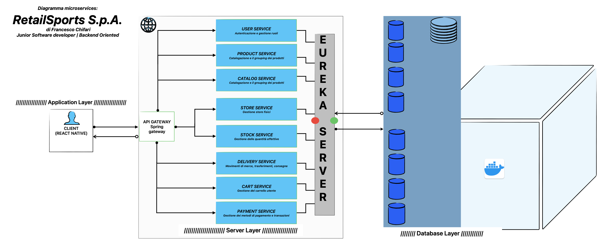

# 🛍️ RetailSports Microservices

Piattaforma e-commerce basata su architettura a microservizi per RetailSports S.p.A.


---

## 📋 Descrizione

Piattaforma e-commerce moderna per articoli sportivi con architettura a microservizi basata su Spring Cloud.

## 🏗️ Architettura



*Diagramma dell'architettura a microservizi del sistema RetailSports*

- **Eureka Server** (8761) - Service Discovery
- **API Gateway** (8080) - Routing
- **User Service** (8081) - Autenticazione e gestione utenti
- **Product Service** (8082) - Catalogazione prodotti
- **Cart Service** (8087) - Gestione carrello
- **Payment Service** (8088) - Gestione pagamenti
- Altri servizi: Store, Stock, Delivery, Catalog

## 🚀 Stack Tecnologico

- Java 21, Spring Boot 3.5.9, Spring Cloud 2025.0.1
- MySQL 8.0, Redis
- Gradle, Docker

## 🔧 Setup
```bash
# Clone
git clone https://github.com/CSINCE90/retail-project.git
cd retail-project

# Avvia Eureka Server
cd eureka-server
./gradlew bootRun
```

**Eureka Dashboard**: http://localhost:8761

## 📊 Stato Progetto

| Servizio | Status |
|----------|--------|
| Eureka Server | ✅ Completato |
| API Gateway | ✅ Completato |
| User Service | ✅ Completato  |
| Altri servizi | 📋 Pianificato |

## 👨‍💻 Autore

**Francesco Chifari**  
Software Engineer | Dottore in Informatica  
Backend Development | Microservices Architecture

- GitHub: [@CSINCE90](https://github.com/CSINCE90)
- Linkedin: Francesco Chifari 

---

Progetto sviluppato a scopo didattico/professionale.
